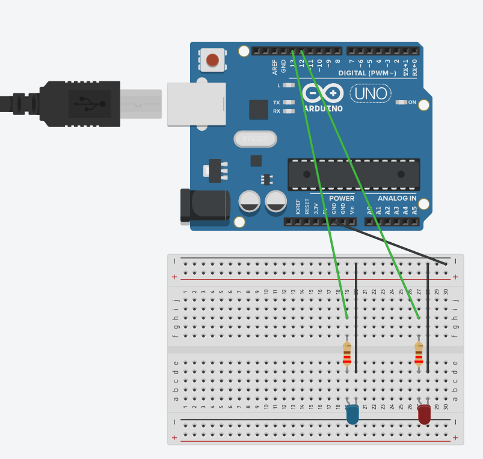

# Not_so_basic_aurduino
## C++
### Blink Revisted
#### Assignment
Creat a version of LED_Blink, but it dradually goes up in brightness and back down in brightness.
#### Code
int ledPin = 5;
int x = 0;

void setup() {
  Serial.begin(9600);
  pinMode(ledPin, OUTPUT);

}

void loop() {
  for (x = 0; x < 255; x++) {
  Serial.println(x);
    analogWrite(ledPin, x);

    delay (25);
  }
  for (x = 255; x > 0; x--) {
  Serial.println(x);
    analogWrite(ledPin, x);

    delay (25);
}
}
### Reflection 
This was a one of the harder assignments this year due to forgetting how to do Aurduino code. At first it was alright but then I had to make it gradullay increase and decrease, I had the code down I was just not putting the wire in the right pin that could be used with analog write.

### Finite LED
#### Assingment
Duplicate your Arduino sketch that blinks an LED on and off.
Make an LED blink 5 times
Extra Spicy part: If you are just crushing these assignments and you want a challenge, try something more complex.  Like try to have one LED blink 5 times and then have another one blink 5 times or something like that.
#### Code  
      int counter = 0;//sets up the variable counter

      void setup() {
        Serial.begin(9600);
        pinMode(13, OUTPUT);
        pinMode(12, OUTPUT);

      void loop() {
      //makes sure that if it reaches ten blink then it will stop
        if (counter < 10) {
          if (counter < 5) {
            counter++;
            Serial.println(counter);
            digitalWrite(13, HIGH);

          delay(1000);

          digitalWrite(13, LOW);

          delay(1000);
        } else if (counter >= 5) {
          counter++;
          Serial.println(counter);//prints out the counter to the serial moniter to show which blink it is on

          digitalWrite(12, HIGH);

          delay(1000);

          digitalWrite(12, LOW);

          delay(1000);
        }
      }
    }

#### Wiring

#### Reflection
This one was not to hard, except when i wanted to do the Extra spicy part. The extra spicy part had you make one led blink 5 times and another blink 5 times, it really caught me up because i forgot to put >= in the second blink, and because it would get to five but nothing would happen if the counter was five so it waould stop and that got me frustrated till I figured out what I was missing.

### Hello Functions
#### Assignment
You need a function uses the HC-SR04 to calculate the distance of an object and return that distance in centimeters. You must move the servo based on that distance and the servo motion must happen via function or functions.
#### Code
    #include <Servo.h>
      Servo servo1;
      int trigPin = 9;
      int echoPin = 8;
      long distance;
      long duration;

      void setup() {
        servo1.attach(7);
         pinMode(trigPin, OUTPUT);
      }

      void loop() {
        ultra();
        servo1.write(0);
        if(distance <= 10){
        servo1.write(90);
        }
      }

      void ultra(){
        digitalWrite(trigPin, LOW);
        delayMicroseconds(2);
        digitalWrite(trigPin, HIGH);
        delayMicroseconds(10);
        digitalWrite(trigPin, LOW);
        duration = pulseIn(echoPin, HIGH);
        distance = duration*0.034/2;
        }
#### Reflection 
this one was very difficult and i am not sure if i got it fully correct but it does turn the servo when something gets closer to the servo. I really didn't know how to do this one and I had to look it up and I was helped by some website.

### NewPing()
#### Assignment
Do something cool but relatively simple using the NewPing library. 
#### Code
    #include <NewPing.h>

    #define TRIGGER_PIN 12
    #define ECHO_PIN 11
    #define MAX_DISTANCE 200

    NewPing myHC_SR04(TRIGGER_PIN, ECHO_PIN, MAX_DISTANCE);

    void setup() {
      Serial.begin(9600);
      pinMode(7, OUTPUT);
      pinMode(8, OUTPUT);
    }

    void loop() {
      Serial.println(myHC_SR04.ping_cm());
      delay(100);
      if (myHC_SR04.ping_cm() <= 20) {
        digitalWrite(7, HIGH);
        delay(60);
        digitalWrite(7, LOW);
        delay(60);
      } else {
        digitalWrite(8, HIGH);
        delay(60);
        digitalWrite(8, LOW);
        delay(60);
      }

    }
#### Reflection
i had a lot of fun with this, as it was pretty simple to make it, but also because I learned that I can download a lot of functions that others have made that I can use for my own. I decide for my assignment to make a program that when the HC-SR04 senses something in 20 millimeters, it blink the red LED, versus when it is beyond 20 millimeters it blink the blue LED.
